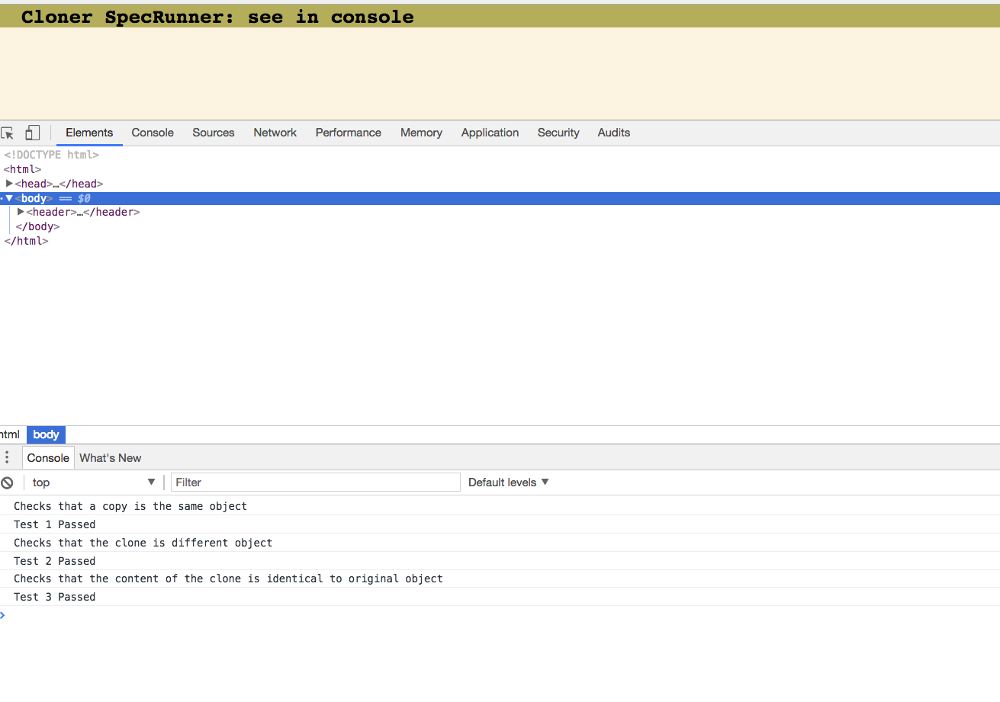

# Cloner

Javascript/Node.js is a language which, despite appearances, is heavily influenced by Lisps.

As such, when an object is created, it is treated almost as a constant by the language.

Therefore, to clone an object require more than just:
```javascript
var obj = { name: "Paddy", address: { town: "Lerum", country: "Sweden" } };
var copy = var obj;
obj.surname = "Jones";
console.log(obj);
  >>{ name: "Paddy", address: { town: "Lerum", country: "Sweden" }, surname: "Jones" }
console.log(copy);
  >>{ name: "Paddy", address: { town: "Lerum", country: "Sweden" }, surname: "Jones" }
```
as the variable `copy` points to the same object as `obj` does.

## To install and run:

- On the command-line, open the SpecRunner.html file:
```
$ open SpecRunner.html
```
And open the console (`CMD-OPT-J` for Chrome) to see the tests pass and to play with the code, e.g:

```javascript
var obj = {names: {forename: "Johnny", surname: "Utah"}, mainAbility: "catching tubes"};
var clone = deepClone(obj);
clone === obj;
// false (😄 )
JSON.stringify(clone) === JSON.stringify(obj);
// true ( 👍 )
```

## Approach

Realising that this was asking me to 'walk the tree' of the object, I defined a base condition that would push a key and value into a clone object if the value was not an object and a recursive condition that would recurse over the value if it were an object.

## Testing

Testing has been achieved using a vanilla javascript test library I have written, given that the task asked not to use 3rd Party Frameworks or libraries.

Tests can be checked by opening SpecRunner.html and opening the console.


